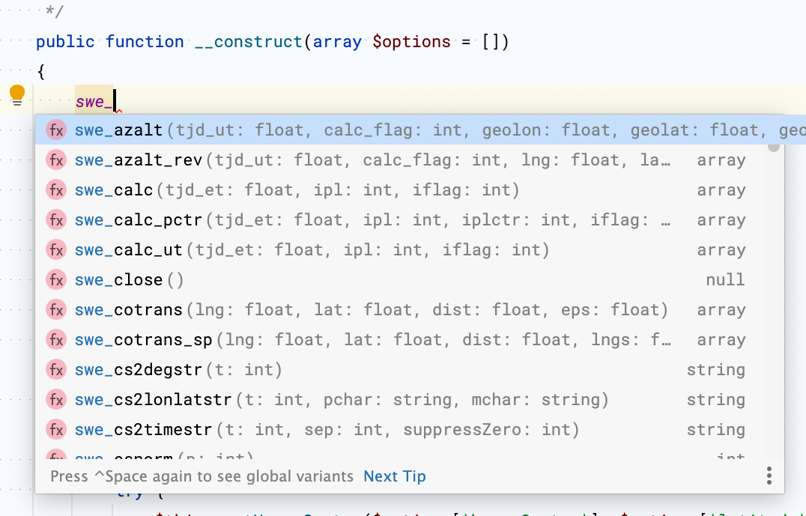

# phpstorm-swephp-plugin

Adds IDE support to PhpStorm for the Swiss Ephemeris PHP extension which is found here:

https://github.com/cyjoelchen/php-sweph

### Installation:
- [Download the JAR file.](https://github.com/arcpointgroup/phpstorm-library-plugin/raw/master/plugin/phpstorm-swephp-plugin.jar)
- Open PhpStorm and install a plugin from disk, selecting the downloaded JAR.
- Restart PhpStorm.

You will see the stub file in your Project window:


When coding, you will see auto-complete suggestions from PhpStorm:



### Updates:

A stub file is maintained in the extension's repository.
All SE library updates should be made to that file which can then be copied into this repository as needed*.

__* The constant definitions in this plugin are not supported by the core PHP file `gen_stub.php`
which is used to generate the arginfo header files required by the extension.
Changes to the extension's stub file must be manually applied to this plugin's stub (vs. copy-replace).__

Don't forget to update the release support in `plugin.xml`.

To turn these files into a plugin:

```
cd plugin
zip -r phpstorm-swephp-plugin.jar *
```
