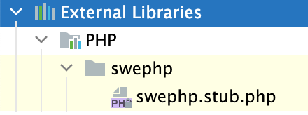

# phpstorm-swephp-plugin

Adds IDE support to PhpStorm for the Swiss Ephemeris PHP extension which is found here:

https://github.com/cyjoelchen/php-sweph

### Installation:
- [Download the JAR file.](https://github.com/arcpointgroup/phpstorm-library-plugin/raw/master/plugin/phpstorm-swephp-plugin.jar)
- Open PhpStorm and install a plugin from disk, selecting the downloaded JAR.
- Restart PhpStorm.

You will see the stub file in your Project window:

When coding, you will see auto-complete suggestions from PhpStorm:

### Updates:

A stub file is maintained in the extension's repository.
All SE library updates should be made to that file which can then be copied into this repository as needed.

Don't forget to update the release support in `plugin.xml`.
